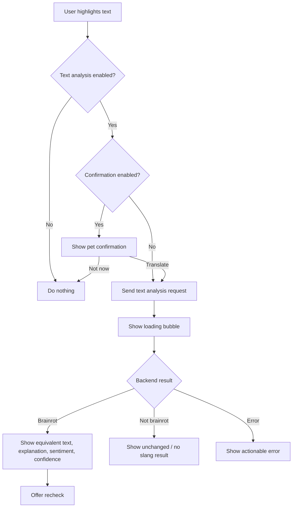
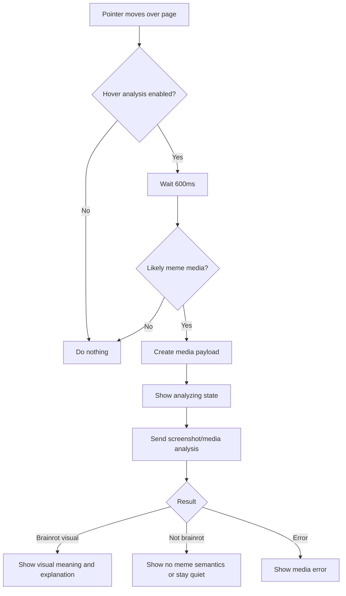
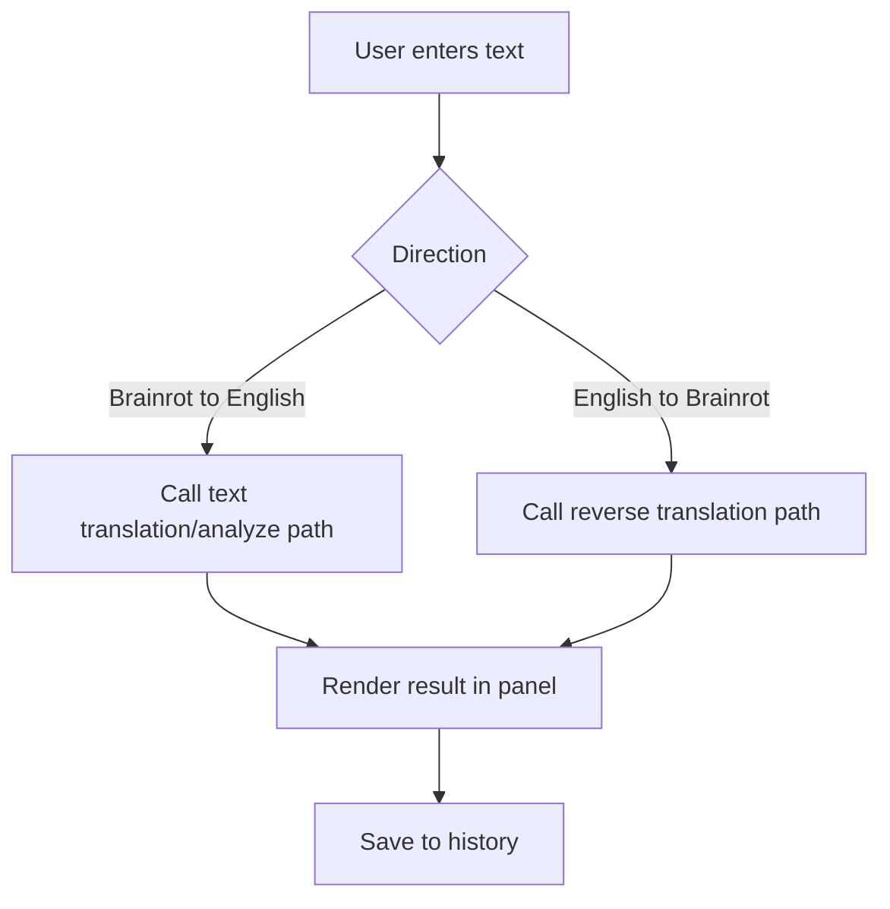
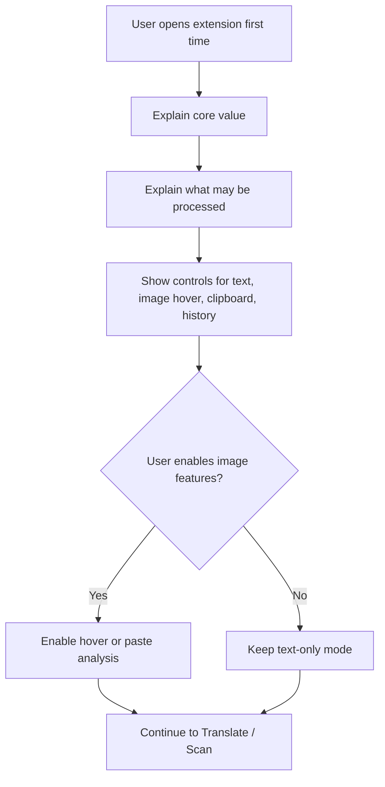
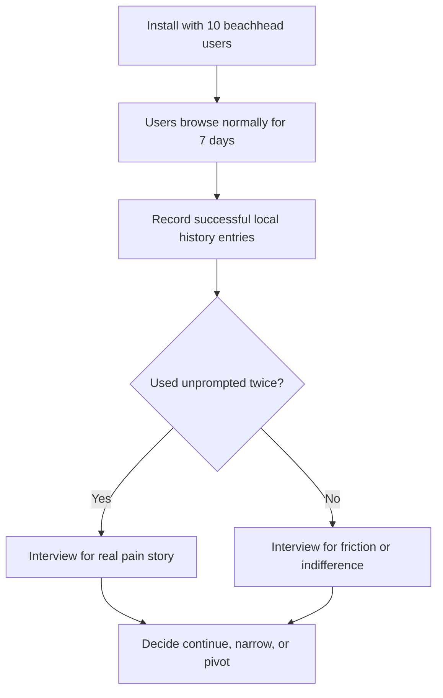
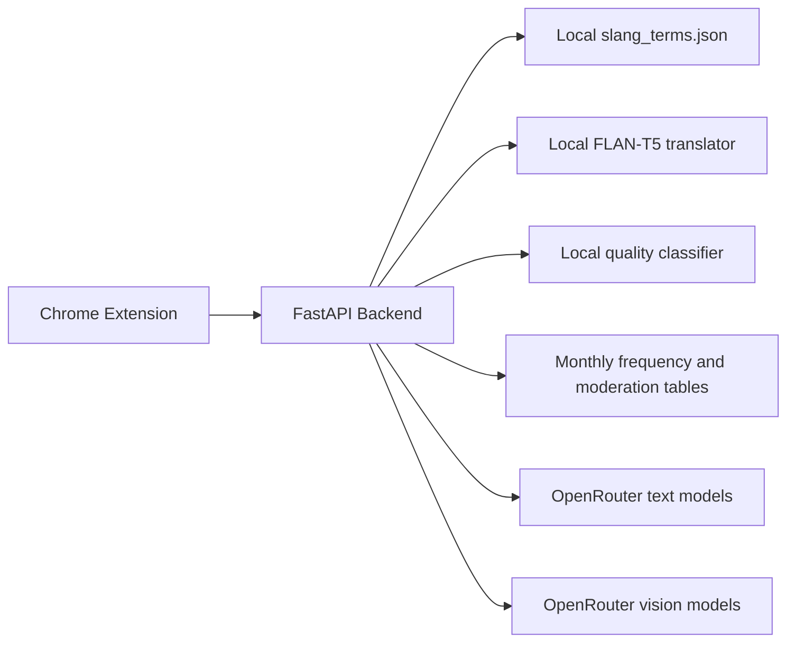
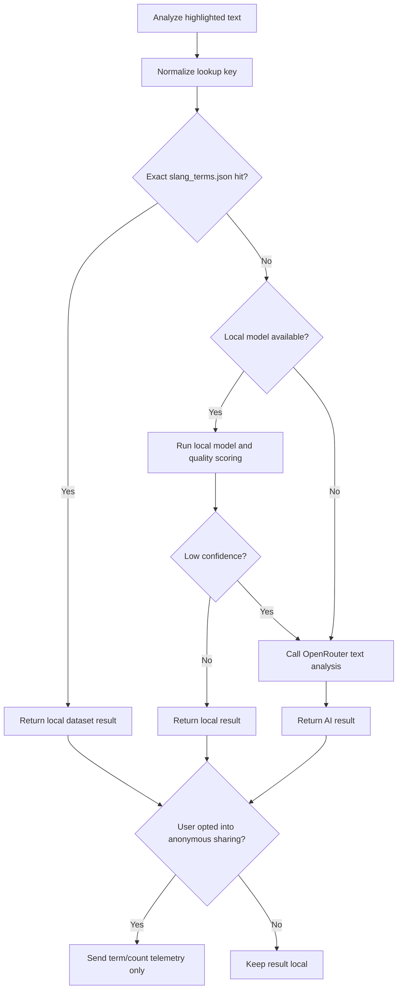
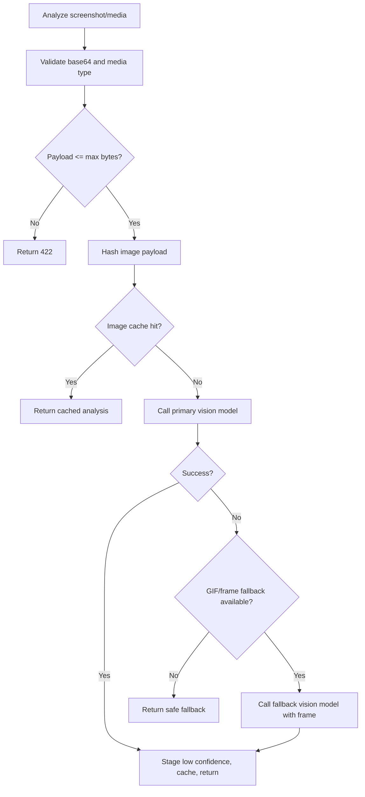

# Brainrot Translator Design Specification

## Design Intent

Brainrot Translator should feel like a lightweight interpretation layer over the web. The experience should be fast, slightly playful, and trustworthy enough that users understand when the system is confident and when it is guessing.

The product has two complementary surfaces:

- A quiet control surface in the Chrome side panel.
- A page-native floating pet that appears only when it has something useful to say.

The side panel is for setup, settings, history, glossary, and direct translation. The floating pet is for in-context answers. Dashboard and review-oriented views should remain secondary until the core extension loop proves repeat usage.

## Stress-Test Design Position

The design should support the stress-test verdict:

- Build as a Chrome extension first.
- Do not position the product as a generic website or broad "translator for everyone."
- Optimize for one beachhead segment first: non-native English speakers, international students, and globally distributed professionals reading English internet culture.
- Treat image analysis as valuable but privacy-sensitive.
- Keep advanced analytics, model training, and review tooling out of the user's main path until repeat usage is proven.
- Validate the core loop by watching whether users return without prompting within 7 days.

## Design Principles

- Stay close to the user's reading flow.
- Translate the whole meaning, not only individual slang terms.
- Explain culture without overexplaining it.
- Show uncertainty instead of pretending every meme has one fixed meaning.
- Make remote analysis intentional and controllable.
- Require the user to bring their own OpenRouter API key for AI features.
- Keep playful UI elements secondary to clarity.
- Prefer local, cached, and offline paths where possible.
- Let advanced users inspect backend status without making casual users debug infrastructure.
- Keep the core loop obvious: highlight text, get meaning, optionally save or recheck.
- Avoid making dashboards or model internals look like the main product.

## Information Architecture

### Side Panel

The side panel has three primary tabs.

1. Translate / Scan
   - First-run privacy and usage reminder.
   - Direct text translator.
   - Direction selector.
   - Active tab connection check.
   - Test bubble trigger.

2. History / Glossary
   - Translation history.
   - History search and type filter.
   - JSON and CSV export.
   - Custom dictionary add/import/export.
   - Dashboard metrics as a secondary advanced section.
   - Slang frequency chart as a secondary advanced section.

3. Settings / Status
   - API base URL.
   - OpenRouter API Key.
   - Text model speed selector.
   - Backend health check.
   - Frontend behavior toggles.
   - Backend, model, and database status cards.
   - Tutorial replay.

### In-Page UI

- Floating pet bubble for confirmations, loading, results, and errors.
- Floating launcher dock for hover toggle, capture, size adjustment, minimize / restore, and drag positioning.
- Optional inline annotations for known terms.
- Context menu and keyboard shortcut paths for users who want direct commands.

### MVP Priority

Primary:

- Highlighted text explanation.
- Meme/image explanation with explicit user control.
- Direct paste translation.
- Custom dictionary.
- Local history.
- Backend health and clear error recovery.

Secondary:

- Reverse translation.
- Screenshot capture.
- Clipboard image paste.
- Page scan and inline annotations.
- Dashboard metrics.
- Review queues and model-improvement surfaces.

## Core Interaction Patterns

### Highlighted Text Flow



### Image Hover Flow



### Direct Translation Flow



### First-Run Privacy Flow



### Validation Loop



## Visual Design Direction

### Tone

The UI may be playful, but it should not be chaotic. The pet identity gives the product personality; the surrounding controls should stay legible and calm.

For the beachhead user, clarity matters more than jokes. Copy should assume the user is already confused by slang and wants the fastest possible plain-English explanation.

### Layout

- Use compact panels in the side panel because width is constrained.
- Keep repeated data in cards only when each card represents one record or metric.
- Keep settings controls aligned and scannable.
- Avoid large marketing-style hero content inside the extension; users are there to operate the tool.
- The first visible side panel state should make the active task obvious.
- Do not put dashboard metrics above translation history or dictionary controls in the MVP.
- Keep privacy controls visible near the features that send image or page context.

### Color and Emphasis

- Use a balanced, high-contrast palette with distinct success, warning, and error states.
- Do not rely on a single hue family for the whole interface.
- Confidence and backend health should use text labels plus color.
- Low-confidence and review-needed states should be visually distinct but not alarming unless the task failed.

### Typography

- Use short labels and direct verbs.
- Avoid negative letter spacing.
- Keep headings compact inside side-panel cards.
- Use readable body text for explanations because cultural nuance is the core value.

### Motion

- Loading states should be visible but restrained.
- Bubble opening and dismissal should be quick.
- Hover analysis should not flicker as the user moves across the page.
- Launcher drag and scale interactions should feel stable and should not move surrounding page content.
- Hover analysis should feel opt-in and reversible, not like the page is being watched continuously.

## Component Design

### Floating Pet Bubble

States:

- Hidden
- Confirmation
- Loading
- Text result
- Image result
- Non-brainrot result
- Error
- Timed info

Text result should include:

- Source label or original snippet.
- Equivalent English.
- Cultural explanation.
- Sentiment label where available.
- Confidence.
- Recheck action.
- Model/source label when useful.

For the MVP, the result should emphasize the equivalent English and concise explanation first. Model details, sentiment, and review status should be visually secondary.

Image result should include:

- Visual meme meaning.
- Equivalent formal English.
- Explanation.
- Confidence.
- Whether a GIF fallback frame was used when relevant.

Error state should include:

- Short problem statement.
- User-actionable recovery guidance.
- No stack traces.

### Floating Launcher

Controls:

- Hover on/off toggle.
- Capture button.
- Scale down.
- Scale value.
- Scale up.
- Minimize.
- Restore.

Behavior:

- Default to right side of viewport.
- Drag vertically from the pet header.
- Clamp to visible viewport bounds.
- Persist position and scale in local storage.
- Do not cover the pet bubble when showing a result if avoidable.
- Show hover state clearly so users know whether image analysis is active.
- In production, start image hover disabled until the first-run privacy flow has explained it.

### First-Run Privacy Gate

Requirements:

- Explain that highlighted text is sent to the configured backend for translation.
- Explain that image hover, screenshot capture, and clipboard paste can send image data when enabled.
- Explain that history and custom dictionary are stored locally unless exported.
- Provide separate controls for text analysis, image hover, clipboard paste, and history.
- Do not bury privacy information inside a long tutorial carousel.
- Allow text-only use without enabling image analysis.

### Side Panel Tabs

Behavior:

- Preserve the last active tab.
- Support click and left/right keyboard navigation.
- Use `aria-selected`, `role="tab"`, and `role="tabpanel"`.
- Keep tab labels short.

### Direct Translator

Controls:

- Text area.
- Direction selector.
- Translate button.
- Result area.

Result rendering:

- Show original and translated text.
- Show confidence and model source where available.
- Show errors inline.
- Save successful translations to history.
- Keep reverse translation available but visually secondary to brainrot-to-English translation during validation.

### Settings

Controls:

- API Base URL input.
- OpenRouter API Key password input.
- Text Model Speed select.
- Save Settings.
- Reset Defaults.
- Behavior toggles.
- Privacy and data controls for image hover, clipboard paste, and local history.

Health cards:

- Backend: Reachable, Unknown, or Not available.
- AI Key / Text Model: Key added, Missing key, or local model hints.
- Database: Connected, Unavailable, or Unknown.

### History

Requirements:

- Search text should debounce.
- Type filter should support all, text, and image.
- Clear should remove local history.
- JSON export should preserve structured fields.
- CSV export should escape values correctly.
- Entries should be compact and readable.
- History should be useful to users even if dashboard metrics are disabled.

Fields:

- Timestamp.
- Type.
- Original or media source.
- Translation / meaning.
- Sentiment.
- Confidence.
- Page URL.
- Page title.
- Model used.

### Custom Dictionary

Requirements:

- Add term and meaning.
- Validate non-empty term and meaning.
- Import JSON or CSV.
- Export dictionary.
- Use custom terms in client-side matching and page scan.

Recommended future behavior:

- Sync custom terms to backend for server-side matching.
- Detect duplicate terms and offer replace/merge.
- Add categories or notes.

### Dashboard

Dashboard is an advanced surface, not the primary proof of value. It should not crowd the main translation workflow.

Metrics:

- Total text analyses.
- Total image analyses.
- Unique slang terms.
- Top term and count.
- Top slang frequency chart.

Empty states:

- No database configured.
- No terms logged yet.
- Backend unavailable.

Recommended MVP placement:

- Keep dashboard below history and glossary.
- Label database-dependent states clearly.
- Avoid using dashboard charts as the first-run hook.

### Validation Instrumentation

The validation MVP should be able to answer these questions without invasive analytics:

- Did the user complete a first successful text translation?
- Did the user translate again within 7 days?
- Which feature triggered the translation: highlight, direct paste, hover image, capture, paste image, context menu, or shortcut?
- Did the user add a custom dictionary term?
- Did the user disable image hover after trying it?

This can be measured from local history during user interviews or through explicit opt-in diagnostics. Do not silently ship broad tracking as part of the MVP.

## Backend Design

### Runtime Topology



### Text Routing



### Image Routing



### Database Tables

- `cached_text_translations`
- `cached_image_analyses`
- `verified_text_brainrot`
- `verified_image_brainrot`
- `monthly_slang_frequency`
- `slang_moderation`

Cache/review tables remain local-development and legacy support surfaces. Production shared ranking uses `monthly_slang_frequency` for opt-in anonymous term counts and `slang_moderation` to hide or ban unsafe terms from public charts.

## API Contract Summary

### `GET /health`

Returns runtime status:

- Backend status.
- Database configured.
- Local text model available / loaded.
- Local quality classifier available / loaded.
- User OpenRouter key present.
- Text recheck configured for this request.
- API base URL.

### `POST /api/v1/analyze-highlighted-text`

Input:

- `selected_text`
- `text_model_tier`
- `page_url`
- `surrounding_text`
- `page_title`
- `page_domain`
- `nearest_heading`

Output:

- `is_brainrot`
- `brainrot_text`
- `equivalent_text`
- `formal_explanation`
- `sentiment_label`
- `sentiment_rationale`
- `confidence_score`
- `flagged_for_review`
- `model_used`

### `POST /api/v1/recheck-highlighted-text`

Same input and output as highlighted text analysis. This route intentionally forces a remote re-analysis path instead of relying on existing local or cached output.

### `POST /api/v1/reverse-translate`

Input:

- `text`
- `page_url`
- `text_model_tier`

Output:

- `reverse_text`
- `confidence_score`
- `model_used`

### `POST /api/v1/analyze-screenshot-media`

Input:

- `image_base64`
- `media_type`
- `image_model_tier`
- `source_url`
- `frame0_base64`
- `frame0_media_type`
- `page_title`
- `page_domain`

Output:

- `is_brainrot`
- `brainrot_meaning`
- `equivalent_text`
- `formal_explanation`
- `confidence_score`
- `flagged_for_review`
- `model_used`
- `used_frame_fallback`

### `POST /api/v1/telemetry/slang-detections`

Input:

- `items`: detected slang terms and counts.
- `extension_version`

This route is called only when the user enables anonymous sharing. It must not receive raw page text, URLs, domains, image payloads, or OpenRouter API keys.

### `GET /api/v1/public/top-slang`

Query:

- `period`: `month` or `year`
- `year`
- `limit`

Returns moderated public rankings. Monthly view reads the current calendar month. Yearly view aggregates archived monthly counts.

### `GET /api/v1/admin/slang`

Requires Google ID-token bearer auth for configured admin emails. Returns terms, total counts, moderation status, unsafe flag, and update metadata.

### `PATCH /api/v1/admin/slang/{normalized_term}`

Requires Google admin auth. Updates `status` to `visible`, `hidden`, or `banned` plus an optional reason.

## Data Design

### History Entry

Recommended normalized client history shape:

```json
{
  "timestamp": "2026-06-13T00:00:00.000Z",
  "type": "text",
  "original": "he has rizz",
  "translation": "He is charming or charismatic.",
  "sentiment": "positive",
  "confidence": 0.95,
  "source_url": "",
  "page_url": "https://example.com",
  "page_title": "Example",
  "model_used": "local_cache_slang_json"
}
```

### Custom Dictionary Entry

```json
{
  "term": "rizzler",
  "meaning": "someone with strong charisma or flirting ability"
}
```

### Review Item

Review rows should store:

- Source text or media URL.
- Agent output.
- Confidence.
- Human verified flag.
- Correct meaning.
- Timestamp.

Future review UI should allow approve, edit, reject, and export-to-training-data actions.

## Error and Empty State Design

### Backend Unreachable

Message:

`Backend unavailable. Check that the FastAPI server is running and the API Base URL is correct.`

Actions:

- Check Health.
- Reset Defaults.
- Use offline glossary where possible.

### OpenRouter Key Missing Or Invalid

Message:

`OpenRouter API key is missing or invalid. Add your key in Settings.`

Actions:

- Open Settings / Status.
- Update OpenRouter API Key.
- Save Settings.

### Rate Limited

Message:

`Please wait before trying again. The backend rate limit was reached.`

Actions:

- Retry after cooldown.
- Avoid duplicate hover or rapid selection calls.

### Non-Brainrot Result

Message pattern:

`No brainrot or internet slang marker was detected, so the text was left unchanged.`

Behavior:

- Keep confidence visible.
- Avoid making the result feel like a hard failure.

### Low Confidence

Message pattern:

`This interpretation may need review.`

Actions:

- Recheck.
- Send anonymous term/count telemetry only when the user opts in.

## Security and Privacy Design

- OpenRouter API key is entered by the user in extension settings.
- The extension stores the user key in extension-controlled Chrome storage and sends it directly to OpenRouter from the background service worker. The default is `chrome.storage.local` for this browser profile; privacy mode uses `chrome.storage.session` until Chrome closes.
- Backend and telemetry requests must not include the OpenRouter key.
- The backend must not read a shared OpenRouter API key from `.env`.
- `.env` should hold backend secrets and must not be committed.
- Extension settings and history are stored locally.
- Remote model calls go directly from the extension background service worker to OpenRouter.
- Media payload size is capped.
- Hover analysis is user-toggleable and should be opt-in for production onboarding.
- Clipboard image analysis is user-toggleable and should be opt-in for production onboarding.
- Page context should be limited to title, domain, URL, nearby heading, and surrounding text.
- Users should be able to run in text-only mode.
- Future production versions should add per-site permissions and history retention controls.

## Accessibility Design

- Keep side panel controls reachable with keyboard.
- Preserve ARIA tab semantics.
- Provide labels for icon-like or compact controls.
- Avoid color-only confidence or health indicators.
- Ensure bubble text remains readable at launcher scale values from 70% to 150%.
- Maintain sufficient contrast for success, warning, and error cards.

## Implementation Notes

- The extension defaults to `http://127.0.0.1:8000`.
- AI recheck, reverse translation, remote text fallback, and image analysis require the user's OpenRouter API key from extension settings.
- Text and image model tiers map to env-controlled OpenRouter model IDs. Defaults are Free NVIDIA for both text and image; Premium maps to DeepSeek for text and Gemini for image understanding.
- Anonymous shared frequency is opt-in and sends only term/count pairs.
- Local text model path is `models/brainrot-translator-v1`.
- Local quality classifier path is `models/brainrot-quality-classifier-v1`.
- Reference dataset path is `data/processed/slang_terms.json`.
- The local extension uses `chrome.storage.local` for non-secret settings, offline glossary, custom dictionary, history, onboarding state, launcher state, active side-panel tab, and the default remembered OpenRouter key. If the user disables "Remember OpenRouter key on this device," the OpenRouter key moves to `chrome.storage.session` and is forgotten when Chrome closes. The key is never stored in Chrome sync, the backend database, telemetry, or `.env`.

## QA Checklist

### Core Extension Validation

- Start backend and verify `/health`.
- Load extension unpacked in Chrome.
- Open a normal `http` or `https` page.
- Check active page connection from side panel.
- Highlight a known slang phrase.
- Confirm translation appears in pet bubble.
- Recheck the same phrase.
- Direct translate brainrot to English.
- Hover a likely meme image with hover enabled.
- Add a custom dictionary term.
- Export and clear history.
- Toggle each frontend behavior and confirm it changes page behavior.
- Confirm text-only mode works with image features disabled.
- Confirm first-run privacy copy appears before image hover is enabled in production builds.
- Test backend offline behavior.
- Test missing or invalid OpenRouter key behavior.
- Test rate-limit messaging.

### Advanced / Non-MVP Regression

- Direct translate English to brainrot.
- Paste an image from clipboard.
- Use launcher capture.
- Scan page and verify inline annotations.
- Import and export dictionary.
- Verify dashboard empty and populated states.

## Future Design Improvements

- Add per-site hover analysis permissions.
- Add full history retention controls.
- Add a low-confidence review queue UI.
- Add before/after comparison for rechecked outputs.
- Add model/source badges in every result.
- Add a compact mode for the floating bubble.
- Add a "translate this page" mode with batch limits.
- Add backend endpoint for custom dictionary sync.
- Add screenshots or visual regression tests for side panel and bubble states.
- Add a public demo page only after the extension has proved repeat usage.
