# Brainrot Translator - Mini Markdown Report
🟥 **WIF3009 • GROUP 5** 

## 👥 Team Members - WIF3009 Group 5 
>Lim Rui Xuan	24004520

>Jayden Teh Jing Siang	23051409

>Adrian Phang 	24063588

>Edwin Tan Yu Xian	23097193

>ZOU MINGXUAN	23093996

## 1. Project Overview

Brainrot Translator is a Natural Language Processing (NLP) and machine learning project designed to translate modern internet, Gen Z, and brainrot slang phrases into clearer standard English. The project treats the problem as a text-to-text translation task, where the input is an informal slang phrase and the output is a clearer English meaning.

The main machine learning approach is a Sequence-to-Sequence (Seq2Seq) text generation model. In the current project files, the main translator training notebook uses `google/flan-t5-small`, a T5-style encoder-decoder model suitable for transforming one text sequence into another. The project demonstrates the full NLP workflow: dataset preparation, text cleaning, tokenization, model training, validation, sample generation, model saving, and model export.

In addition to the model-training workflow, the project also includes a local FastAPI backend and a Chrome Manifest V3 browser extension. The extension provides an interface for users to translate highlighted slang text on webpages, recheck selected text, analyze image or GIF meme content through the backend, and view usage statistics through a side panel dashboard. These application components support the trained model but are separate from the core machine learning training process.

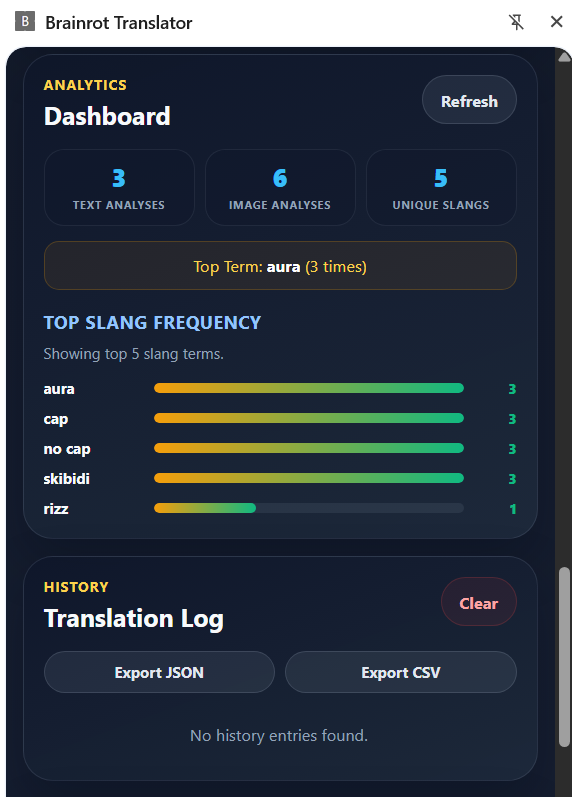

## 2. Project Objectives

| No. | Objective | Achievement Evidence |
| --- | --- | --- |
| 1 | Build a custom brainrot slang translation dataset. | Dataset file prepared at `data/processed/training_dataset_final_local_only.csv`. |
| 2 | Preprocess and clean text data. | Dataset preparation scripts and reports are available in `scripts/` and `data/processed/`. |
| 3 | Tokenize input and target sentences. | Tokenization logic is included in `notebooks/train_flan_t5_colab.ipynb`. |
| 4 | Train a Seq2Seq translation model. | Main training notebook uses `google/flan-t5-small` for text-to-text generation. |
| 5 | Evaluate model performance using training and validation loss. | Training loop prints epoch-level `train_loss` and `eval_loss`; final values should be inserted after the submitted run. |
| 6 | Save the trained model and tokenizer for future use. | Saved files exist under `models/brainrot-translator-v1/`. |
| 7 | Test the model using sample brainrot phrases. | Notebook includes sample generation logic using `model.generate()`. |

## 3. Technologies and Materials Used

| Category | Technology / Material | Purpose |
| --- | --- | --- |
| Programming language | Python | Main language for data processing, model training, and evaluation. |
| Development environment | Google Colab / Jupyter Notebook / VS Code | Used to run notebooks and training scripts. |
| Deep learning framework | PyTorch | Used for model training and tensor computation. |
| NLP library | Hugging Face Transformers | Used to load the tokenizer and Seq2Seq model. |
| Dataset library | Hugging Face Datasets | Used to convert tabular data into train/test datasets. |
| Data handling | Pandas | Used to load, inspect, clean, and prepare CSV data. |
| Numerical processing | NumPy | Used where numerical operations are required. |
| Backend framework | FastAPI | Provides local API endpoints for translation, analysis, dashboard data, and health checks. |
| Browser extension platform | Chrome Manifest V3 | Provides the browser-side interface, content scripts, side panel, context menu, and keyboard command. |
| Local storage | `chrome.storage.local` | Stores extension settings, history, custom dictionary entries, and launcher preferences. |
| Optional database | SQLite / SQLAlchemy-supported database URL | Stores cache, review staging data, and dashboard frequency counters when configured. |
| Main model | `google/flan-t5-small` | Seq2Seq text-to-text model for slang-to-English translation. |
| Secondary model | `distilbert-base-uncased` | Optional quality classifier for scoring translation quality. |
| Tokenizer | Hugging Face tokenizer | Converts text into token IDs for the model. |
| Custom dataset | `training_dataset_final_local_only.csv` | Parallel dataset of slang input and standard English target text. |
| Saved translator folder | `models/brainrot-translator-v1/` | Stores trained translator model, tokenizer, and configuration files. |
| Saved classifier folder | `models/brainrot-quality-classifier-v1/` | Stores optional quality classifier model and tokenizer files. |
| ZIP export | `brainrot-translator-v1.zip` / `brainrot-quality-classifier-v1.zip` | Optional exported model archives from Colab. |

## 4. Required Materials for Submission

The following materials should be submitted or made available for marking:

- `REPORT.md`
- Source code notebook or Python file, especially `notebooks/train_flan_t5_colab.ipynb`
- Dataset file, such as `data/processed/training_dataset_final_local_only.csv`
- Saved model folder, such as `models/brainrot-translator-v1/`
- Saved tokenizer files inside the saved model folder
- Training result screenshot
- Evaluation metric screenshot
- Sample translation output screenshot
- Model saving screenshot
- ZIP file of trained model if required
- `requirements.txt` if available
- `README.md` if available
- Backend source files in `api/`
- Browser extension files in `extension/`
- Project structure documentation, if submitted, such as `docs/PROJECT_STRUCTURE.md`

## 5. Dataset Description

The dataset is a custom slang-to-standard-English parallel dataset. Each row represents one supervised training example. The input column contains a brainrot, Gen Z, or internet slang phrase. The target column contains the clearer standard English interpretation.

This is a supervised learning dataset because both the source input and the expected output are provided. The model learns the mapping from informal language to clearer English during training.

The current project evidence shows the main training dataset file:

```text
data/processed/training_dataset_final_local_only.csv
```

The current dataset extension report states:

| Dataset Item | Value |
| --- | --- |
| Original rows | 3602 |
| Malformed rows removed | 2 |
| Base rows kept | 3600 |
| Manual gold rows added | 600 |
| Final rows | 4200 |

| Column Name | Description | Example |
| --- | --- | --- |
| `input_text` | Brainrot phrase or instruction-formatted slang input. | `Convert brainrot English to normal English: rizz` |
| `target_text` | Standard English meaning or translation. | `This means charm, charisma, or romantic appeal.` |
| `task_type` | Type of training task, such as term definition or sentence translation. | `term_definition` |
| `source` | Source label for the row. | `gemini_synthetic_brainrot_dataset` |
| `quality_label` | Quality label assigned during dataset preparation. | `synthetic_high_quality` |
| `reason` | Short explanation of why the row exists or how it was generated. | `Standard term definition task for rizz.` |

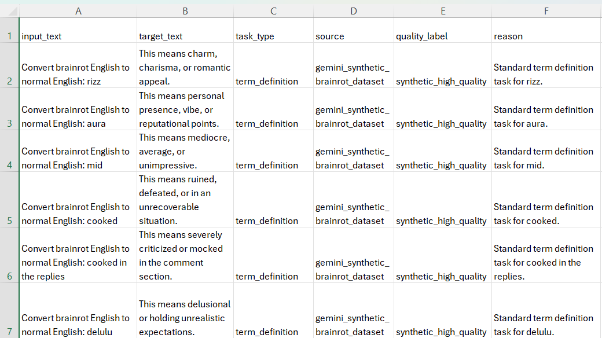

## 6. Data Preprocessing

Data preprocessing is necessary because machine learning models require consistent and clean input. In this project, preprocessing focuses on preparing the slang-to-English pairs into a reliable format for Seq2Seq training.

The project includes dataset preparation and repair scripts in the `scripts/` folder. The current evidence shows that malformed rows were removed and additional manually reviewed examples were added to improve training quality.

| Preprocessing Step | Purpose | Evidence |
| --- | --- | --- |
| Load dataset | Read the CSV dataset into a dataframe. | `training_dataset_final_local_only.csv` |
| Remove malformed rows | Prevent invalid rows from corrupting training. | `malformed_rows_removed: 2` in the extension report |
| Convert text to string format | Ensure all inputs and targets can be tokenized. | Required before tokenizer processing |
| Trim unnecessary spaces | Reduce noisy formatting in source and target text. | Included as a standard text-cleaning step |
| Check input and target columns | Confirm that the dataset has usable parallel text fields. | Required columns include `input_text` and `target_text` |
| Split dataset into training and validation sets | Allow evaluation on unseen data. | Notebook uses a train/test split with `test_size=0.15` |
| Prepare instruction format | Make the model learn the intended task explicitly. | Inputs use `Convert brainrot English to normal English:` prefix |

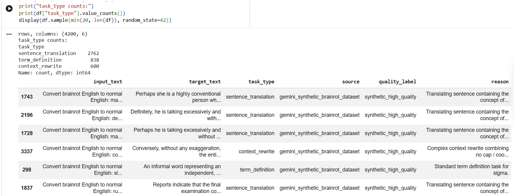

## 7. Tokenization Process

Raw text cannot be directly understood by a neural network. The tokenizer converts each input sentence and target sentence into numerical token IDs. These token IDs are then passed into the Seq2Seq model.

In this project, the input text and target text are tokenized separately. Padding and truncation may be applied so that batches have consistent sequence lengths. The tokenized dataset is then passed into the training loop or trainer.

```python
def preprocess_function(examples):
    inputs = examples["input_text"]
    targets = examples["target_text"]

    model_inputs = tokenizer(
        inputs,
        max_length=128,
        truncation=True,
        padding="max_length"
    )

    labels = tokenizer(
        targets,
        max_length=128,
        truncation=True,
        padding="max_length"
    )

    model_inputs["labels"] = labels["input_ids"]
    return model_inputs
```


## 8. Model Selection

This project uses a Seq2Seq model because the task requires transforming one text sequence into another text sequence. The input is a slang phrase or instruction-formatted slang sentence, and the output is a clearer English translation.

Seq2Seq modelling is suitable because the input and output may have different lengths. For example, a short slang phrase such as `rizz` may require a longer explanatory output such as `This means charm, charisma, or romantic appeal.`

Model used: `google/flan-t5-small`

The saved translator model configuration confirms a T5-style encoder-decoder architecture. The saved model folder is:

```text
models/brainrot-translator-v1/
```

| Model Component | Explanation |
| --- | --- |
| Tokenizer | Converts slang input and target English text into token IDs. |
| Encoder | Reads and represents the input brainrot phrase. |
| Decoder | Generates the clearer English output sequence. |
| Training objective | Minimize sequence generation loss between predicted tokens and target tokens. |
| Output generation | Uses `model.generate()` to produce the translated text after training. |


## 9. Training Configuration

The main training notebook uses a manual PyTorch training loop rather than relying only on `Seq2SeqTrainer`. The configuration below is based on the current `notebooks/train_flan_t5_colab.ipynb` evidence.

| Parameter | Value | Explanation |
| --- | --- | --- |
| Model name | `google/flan-t5-small` | Base Seq2Seq model used for translation. |
| Number of epochs | `4` | Number of complete passes through the training data. |
| Batch size | `8` | Number of samples processed per training step. |
| Learning rate | `5e-5` | Optimizer step size. |
| Training steps per epoch | `765` steps | Actual FLAN-T5 training log shows `765/765` steps for each epoch. |
| Training dataset size | `[insert exact training row count from notebook]` | The exact row count should be taken from the dataset split output; the pasted log confirms the number of batches, not the raw row count. |
| Validation dataset size | `[insert exact validation row count from notebook]` | Validation loss was calculated after each epoch. |
| Output directory | `brainrot-translator-v1` | Folder where the model is saved in Colab. |
| Evaluation strategy | Per epoch | Training loop prints train and evaluation loss at the end of each epoch. |
| Optimizer | `torch.optim.AdamW` | AdamW optimizer with weight decay. |

If a `Seq2SeqTrainer` version is used, the equivalent configuration may look like this:

```python
training_args = Seq2SeqTrainingArguments(
    output_dir="brainrot-translator-model",
    eval_strategy="epoch",
    save_strategy="epoch",
    learning_rate=5e-5,
    per_device_train_batch_size=8,
    per_device_eval_batch_size=8,
    num_train_epochs=4,
    predict_with_generate=True
)
```


## 10. Model Training Process

The trainer or training loop starts training using the tokenized dataset. During training, the training loss is monitored to check whether the model is learning from the training examples. Validation loss is used to estimate whether the model generalizes beyond the training set.

The notebook should also check for non-finite loss values such as `NaN` or `Inf`. A model should only be saved permanently if training completes successfully and the loss values are valid.

The project contains two Colab model-training workflows:

| Model | Purpose | Local Notebook | Google Colab URL |
| --- | --- | --- | --- |
| Translator model | Translate brainrot slang into standard English. | `notebooks/train_flan_t5_colab.ipynb` | `https://colab.research.google.com/` then upload/open this notebook. If hosted on GitHub, use `https://colab.research.google.com/github/[username]/[repo]/blob/[branch]/notebooks/train_flan_t5_colab.ipynb`. |
| Quality classifier | Score whether a generated translation is good or bad. | `notebooks/train_quality_classifier_colab.ipynb` | `https://colab.research.google.com/` then upload/open this notebook. If hosted on GitHub, use `https://colab.research.google.com/github/[username]/[repo]/blob/[branch]/notebooks/train_quality_classifier_colab.ipynb`. |

Example training and evaluation code:

```python
train_result = trainer.train()
model = trainer.model

eval_metrics = trainer.evaluate()
print("Evaluation metrics:", eval_metrics)

train_loss = train_result.training_loss
eval_loss = eval_metrics.get("eval_loss")

print(f"Training loss: {train_loss:.4f}")
print(f"Validation loss: {eval_loss:.4f}")
```

The current FLAN-T5 notebook uses a manual loop with the same evaluation idea:

```python
for epoch in range(1, EPOCHS + 1):
    model.train()
    running_loss = 0.0
    finite_steps = 0

    for batch in train_loader:
        outputs = model(**batch)
        loss = outputs.loss

        if not torch.isfinite(loss):
            raise ValueError(f"Non-finite training loss: {loss.item()}")

        loss.backward()
        optimizer.step()
        scheduler.step()
        optimizer.zero_grad()

        running_loss += loss.item()
        finite_steps += 1

    train_loss = running_loss / max(1, finite_steps)
    eval_loss = evaluate()
    print(f"epoch={epoch} train_loss={train_loss:.4f} eval_loss={eval_loss:.4f}")
```


## 11. Evaluation Results

Evaluation includes numerical loss values and manual inspection of generated translations. Loss values measure how well the model predicts the target tokens, while manual testing checks whether the generated English meaning is actually useful and understandable.

| Metric | Result | Interpretation |
| --- | --- | --- |
| Final training loss | `0.5740` | The model's training loss decreased substantially by Epoch 4, showing that the model learned from the training data. |
| Final validation loss | `0.3463` | The validation loss also decreased, suggesting improved generalization on the validation set. |
| Final evaluation loss | `0.3463` | The final evaluation loss is the Epoch 4 validation loss from the translator training run. |
| Sample output quality | `[insert short comment]` | Manual judgement of whether generated translations are clear and accurate. |

Lower loss generally indicates better model learning. However, low training loss alone is not enough. Validation loss helps identify whether the model generalizes beyond training examples. Translation quality should also be checked manually using sample slang phrases.

The main FLAN-T5 translator training history is shown below:

| Epoch | Steps | Train Loss | Eval Loss | Interpretation |
| --- | --- | --- | --- | --- |
| 1 | `765/765` | `2.0610` | `0.9364` | Initial epoch; model begins learning the slang-to-English mapping. |
| 2 | `765/765` | `0.9670` | `0.5303` | Large loss reduction, showing improved learning. |
| 3 | `765/765` | `0.6758` | `0.3858` | Continued improvement on both training and validation loss. |
| 4 | `765/765` | `0.5740` | `0.3463` | Best reported translator evaluation loss in this run. |


For the optional quality classifier model, the training run shows the following recorded evaluation evidence:

| Epoch | Train Loss | Eval Loss | Eval Accuracy |
| --- | --- | --- | --- |
| 1 | `0.2535` | `0.0733` | `0.9762` |
| 2 | `0.0367` | `0.0351` | `0.9915` |
| 3 | `0.0272` | `0.0445` | `0.9899` |


This classifier evidence is secondary. The main project evaluation remains the Seq2Seq translator training and validation loss, because translation is the primary project task.

>**Evaluation Result of Translator Model**
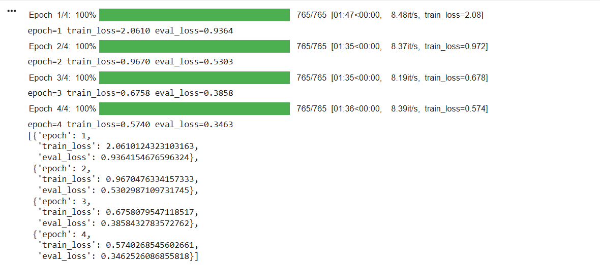
>**Evaluation Result of Classifier Model**
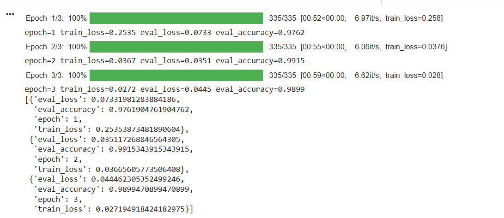

## 12. Sample Translation Testing

After training, the model should be tested by giving it sample brainrot phrases that were not simply copied from the training evidence. The output should be inspected manually to determine whether the translation is clear, accurate, and grammatically acceptable.

| Input Brainrot Phrase | Model Output | Expected Meaning | Comment |
| --- | --- | --- | --- |
| `skill issue` | The problem is caused by lack of ability. | The problem is due to insufficient skill or ability. | Clear and accurate translation. |
| `he has rizz` | He has charm or romantic charm. | He has charm or romantic appeal. | Accurate meaning, although the word `charm` is repeated. |
| `that movie was mid` | That movie was highly mediocre. | The movie was mediocre or unimpressive. | Mostly accurate, but `highly mediocre` sounds slightly unnatural. |
| `bro got cooked in the replies` | He was heavily criticized or mocked in the comment section. | He was strongly criticized or mocked in the replies. | Clear and contextually accurate translation. |
| `she ate and left no crumbs` | She performed flawlessly. | She performed extremely well or flawlessly. | Strong translation with concise standard English output. |

Example generation code:

```python
def translate(text):
    prompt = f"Convert brainrot English to normal English: {text.strip()}"
    inputs = tokenizer(
        prompt,
        return_tensors="pt",
        truncation=True,
        max_length=128
    ).to(model.device)

    outputs = model.generate(
        **inputs,
        max_new_tokens=128,
        num_beams=4,
        do_sample=False
    )

    return tokenizer.decode(outputs[0], skip_special_tokens=True)
```

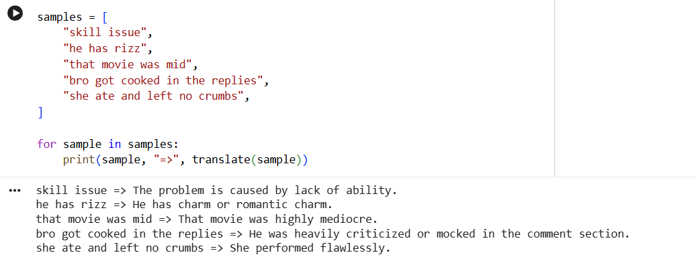

The screenshot above should show:

- The test input phrase.
- Generated model output.
- Output printed in the notebook or terminal.

## 13. Browser Extension Features

The project includes a Chrome Manifest V3 extension that acts as the user-facing interface for the Brainrot Translator system. The extension is not the training environment; instead, it connects webpage interactions to the local backend API and displays translation or analysis results to the user.

The extension files are located in:

```text
extension/
```

The main extension components are:

| Extension File | Purpose |
| --- | --- |
| `manifest.json` | Defines the Manifest V3 extension metadata, permissions, content scripts, side panel, background worker, and keyboard command. |
| `background.js` | Handles the context menu, keyboard shortcut, screenshot capture request, and extension background events. |
| `content_script.js` | Injects the in-page floating launcher, reads highlighted text, sends requests to the backend, and handles hover/capture flows. |
| `pet_bubble.js` | Displays in-page translation and analysis result bubbles. |
| `sidepanel.html` | Provides the persistent side panel interface for settings, health checks, dashboard statistics, and history. |
| `popup.js` | Implements side panel logic, API health checks, settings persistence, dashboard refresh, and local history handling. |
| `pet_shell.css`, `popup.css`, `sidepanel.css` | Provide styling for the floating launcher, result bubble, and side panel interface. |

The extension can perform the following functions:

| Feature | Description | Evidence in Project Files |
| --- | --- | --- |
| Highlighted text translation | User highlights slang text on a webpage and the extension sends it to the backend for translation. | `content_script.js`, `/api/v1/analyze-highlighted-text` |
| Manual recheck | User can recheck highlighted text through the backend recheck endpoint, which may use the configured OpenRouter/DeepSeek fallback. | `content_script.js`, `/api/v1/recheck-highlighted-text` |
| Floating launcher | The extension injects a floating Brainrot Scout launcher into webpages. | `content_script.js`, `pet_shell.css` |
| Screenshot capture | The floating launcher can request a visible tab capture through the background service worker. | `background.js`, `content_script.js` |
| Image/GIF meme analysis | Screenshot or media analysis can be routed to the backend media-analysis endpoint. | `/api/v1/analyze-screenshot-media` |
| Hover detection | The extension can run a delayed hover flow for likely brainrot media when enabled. | `content_script.js`, `sidepanel.html` |
| Context menu translation | The extension adds a right-click option for translating selected brainrot text. | `background.js` |
| Keyboard shortcut | The extension supports `Ctrl+Shift+B` or `Command+Shift+B` for selected-text translation. | `manifest.json`, `background.js` |
| Side panel settings | Users can configure API base URL and feature toggles from the side panel. | `sidepanel.html`, `popup.js` |
| Dashboard display | The side panel can show word-frequency and aggregate dashboard statistics from the backend. | `popup.js`, `/api/v1/dashboard/word-frequency`, `/api/v1/dashboard/stats` |
| Local extension history | Translation or analysis history can be stored in browser local storage. | `popup.js`, `background.js` |
| Custom dictionary | The side panel logic supports locally stored custom dictionary entries. | `popup.js` |
| Launcher controls | The floating launcher supports scale, minimize, restore, and hover-mode toggling. | `content_script.js`, `pet_shell.css` |


>**Browser Extension Side Panel**

>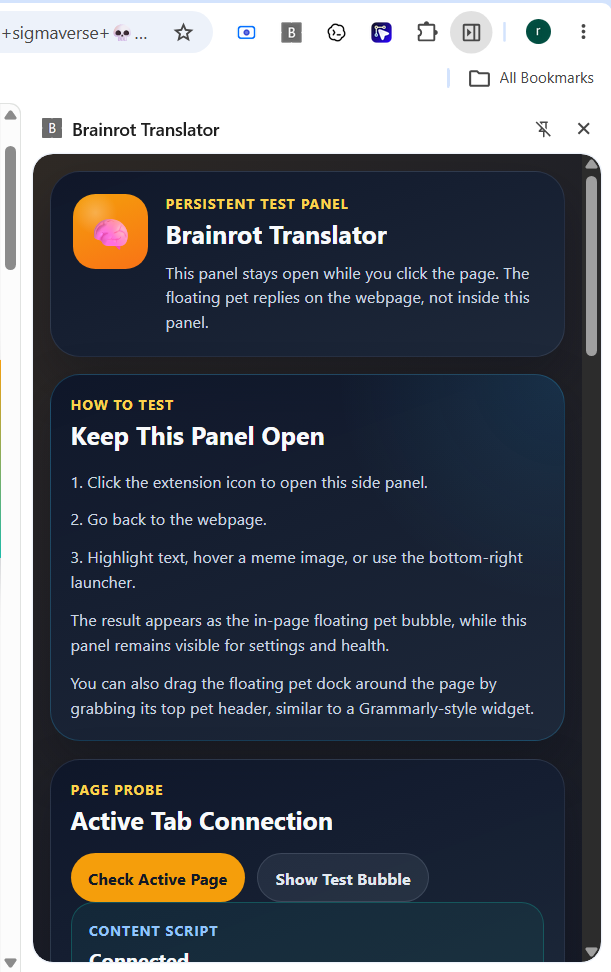

>**Floating Launcher or Translation Bubble**
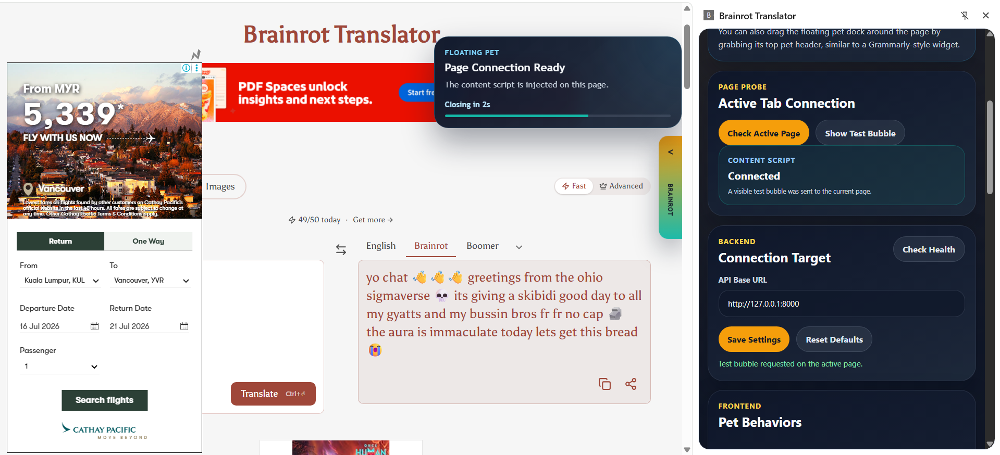

>**Translate Brainrot to English**
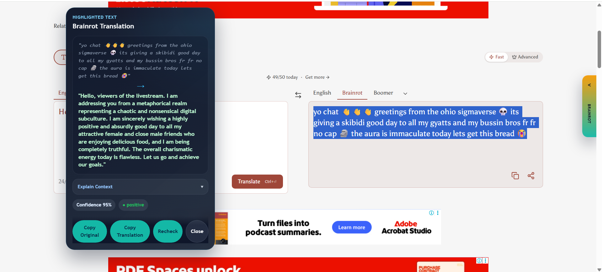

>**Hover Image**


The screenshot above show:

- The in-page floating launcher or result bubble.
- A highlighted-text translation result or analysis result.
- The launcher controls if visible.

## 14. System Architecture

The project uses a local client-server architecture. The machine learning model is trained offline in a notebook, saved into the `models/` folder, and then loaded by the FastAPI backend for use during browser-extension interactions.

| Layer | Main Components | Responsibility |
| --- | --- | --- |
| Data layer | `data/processed/training_dataset_final_local_only.csv` | Stores the supervised slang-to-English parallel training dataset. |
| Training layer | `notebooks/train_flan_t5_colab.ipynb`, `scripts/` | Prepares data, tokenizes text, trains the FLAN-T5 translator, evaluates loss, and saves the model. |
| Model layer | `models/brainrot-translator-v1/`, `models/brainrot-quality-classifier-v1/` | Stores the trained translator model, tokenizer, and optional quality classifier. |
| Backend API layer | `api/main.py`, `api/agent.py`, `api/database.py`, `api/config.py` | Serves health checks, text translation, recheck, media analysis, dashboard statistics, and optional cache/database logic. |
| Browser extension layer | `extension/manifest.json`, `content_script.js`, `background.js`, `sidepanel.html`, `popup.js` | Provides user interaction on webpages and sends requests to the backend. |
| Optional external API layer | OpenRouter / DeepSeek configuration | Used for text recheck or image/GIF analysis when configured. |

The main text-translation architecture flow is:

```text
User highlights slang text on webpage
        |
        v
Chrome extension content script
        |
        v
Local FastAPI backend endpoint
        |
        v
Saved FLAN-T5 translator model and tokenizer
        |
        v
Optional quality classifier confidence scoring
        |
        v
Backend response returned to extension
        |
        v
Translation displayed in webpage bubble or side panel
```

For image or GIF analysis, the flow is different because the trained FLAN-T5 text model is designed for text translation, not visual understanding:

```text
User captures page or hovers media
        |
        v
Chrome extension sends screenshot/media request
        |
        v
FastAPI media-analysis endpoint
        |
        v
Configured OpenRouter vision-capable model, if available
        |
        v
Analysis result returned to extension bubble
```

The backend exposes the following important endpoints:

| Endpoint | Purpose |
| --- | --- |
| `GET /health` | Checks backend status, local model availability, classifier availability, and configuration flags. |
| `POST /translate` | Translates text through the local translation function. |
| `POST /api/v1/analyze-highlighted-text` | Main highlighted-text analysis endpoint used by the extension. |
| `POST /api/v1/recheck-highlighted-text` | Forces a manual recheck route for highlighted text. |
| `GET /api/v1/dashboard/word-frequency` | Returns tracked brainrot word-frequency dashboard data. |
| `GET /api/v1/dashboard/stats` | Returns aggregate dashboard statistics. |
| `POST /api/v1/analyze-screenshot-media` | Analyzes screenshot or media content when configured. |
| `POST /api/v1/analyze-image` | Alias endpoint for image analysis. |

>**System Architecture Diagram**
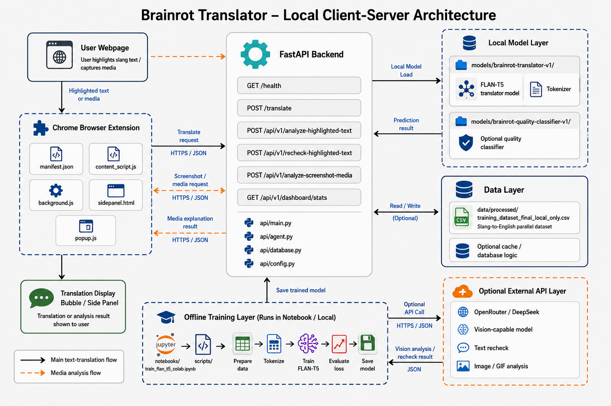

The screenshot or diagram above should show:

- Browser extension client.
- FastAPI backend.
- Saved translator model.
- Optional quality classifier.
- Optional database/cache.
- Optional OpenRouter fallback for recheck or image/GIF analysis.

## 15. Model Saving and Permanent Storage

After training, the model and tokenizer must be saved. Saving allows the trained model to be reused without retraining. The saved folder should contain model weights, tokenizer files, and configuration files.

The current project contains saved translator files under:

```text
models/brainrot-translator-v1/
```

Important saved files include:

| File | Purpose |
| --- | --- |
| `model.safetensors` | Saved model weights. |
| `config.json` | Model architecture and configuration. |
| `generation_config.json` | Generation settings for text output. |
| `tokenizer.json` | Tokenizer vocabulary and tokenization rules. |
| `tokenizer_config.json` | Tokenizer configuration. |

Model saving code:

```python
from pathlib import Path

OUTPUT_DIR = Path("brainrot-translator-v1")
OUTPUT_DIR.mkdir(parents=True, exist_ok=True)
trainer.save_model(OUTPUT_DIR)
tokenizer.save_pretrained(OUTPUT_DIR)
```

Equivalent saving code used in a direct Transformers workflow:

```python
from pathlib import Path

OUTPUT_DIR = Path("brainrot-translator-v1")
OUTPUT_DIR.mkdir(parents=True, exist_ok=True)

model.save_pretrained(OUTPUT_DIR, safe_serialization=True)
tokenizer.save_pretrained(OUTPUT_DIR)
```

Optional ZIP export code:

```python
import shutil

shutil.make_archive(
    base_name="brainrot-translator-v1",
    format="zip",
    root_dir="brainrot-translator-v1"
)
```

Optional Google Colab ZIP download code:

```python
from google.colab import files

!zip -qr brainrot-translator-v1.zip brainrot-translator-v1
files.download("brainrot-translator-v1.zip")
```

> Screenshot of saving `brainrot-translator-v1`

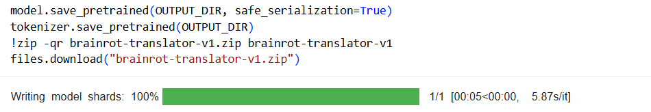

> Screenshot of saving `brainrot-quality-classifier-v1`

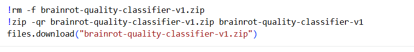

The screenshot above should show:

- The model saving cell or command.
- The saved model directory.
- The ZIP export step if required.

## 16. Reproducibility Instructions

Reproducibility is important because a strict evaluator must be able to repeat the training and verify the outcome. The following steps describe how to reproduce the project.

### 16.1 Install Dependencies

```bash
pip install -r requirements.txt
```

If running in Google Colab, install the required ML packages:

```python
!pip -q install -U transformers datasets accelerate sentencepiece evaluate safetensors
```

### 16.2 Prepare the Dataset

```bash
python scripts/prepare_training_dataset.py
```

If the extended dataset is already prepared, confirm that this file exists:

```text
data/processed/training_dataset_final_local_only.csv
```

### 16.3 Train the Translator Model

Open the translator training notebook:

```text
notebooks/train_flan_t5_colab.ipynb
```

Recommended Colab workflow:

1. Go to `https://colab.research.google.com/`.
2. Upload or open `notebooks/train_flan_t5_colab.ipynb`.
3. Enable GPU runtime.
4. Upload `training_dataset_final_local_only.csv`.
5. Run all training cells.
6. Download `brainrot-translator-v1.zip`.
7. Extract the folder into `models/brainrot-translator-v1/`.

### 16.4 Train the Optional Quality Classifier

Open the classifier training notebook:

```text
notebooks/train_quality_classifier_colab.ipynb
```

Recommended Colab workflow:

1. Go to `https://colab.research.google.com/`.
2. Upload or open `notebooks/train_quality_classifier_colab.ipynb`.
3. Enable GPU runtime.
4. Upload `translation_quality_classifier_dataset.csv`.
5. Run all training cells.
6. Download `brainrot-quality-classifier-v1.zip`.
7. Extract the folder into `models/brainrot-quality-classifier-v1/`.

### 16.5 Run the Backend and Extension

Start the backend locally:

```bash
python -m uvicorn api.main:app --reload
```

Then load the extension in Chrome:

1. Open `chrome://extensions`.
2. Enable Developer mode.
3. Click `Load unpacked`.
4. Select the `extension/` folder.
5. Open the Brainrot Translator side panel.
6. Confirm the API Base URL is `http://127.0.0.1:8000`.
7. Test highlighted-text translation on a normal `http` or `https` webpage.

## 17. Limitations

The project is a focused mini machine learning project and has several limitations:

- The dataset is custom and domain-specific, so model quality depends strongly on dataset coverage and annotation quality.
- Slang changes quickly, so the dataset may become outdated over time.
- Some slang phrases are ambiguous and may require context that is not present in a short input phrase.
- Loss values do not fully measure translation quality, so manual evaluation is still required.
- The Seq2Seq model may produce fluent but inaccurate explanations if the training data is noisy.
- Evaluation loss alone does not prove semantic correctness; sample translations still need manual inspection.
- The Chrome extension requires the local FastAPI backend to be running for full translation functionality.
- Image/GIF analysis is separate from the trained text model and depends on external vision-model configuration when used.

## 18. Academic Integrity and Evidence Statement

This report avoids claiming unsupported features such as user accounts, databases, web deployment, game systems, or unrelated application features as part of the machine learning training pipeline. The report focuses on the evidence available for the NLP/ML component:

- Custom parallel dataset preparation.
- Seq2Seq translator training with FLAN-T5.
- Tokenization and generation workflow.
- Saved translator model and tokenizer files.
- Optional secondary quality classifier evidence.
- FastAPI backend endpoints.
- Chrome Manifest V3 extension files and user-facing interaction features.

Where exact values are still not available, placeholders such as `[insert model output]` are intentionally used. These should be replaced only with real results from the student's own executed notebook.

## 19. Conclusion

Brainrot Translator demonstrates a complete mini NLP machine learning workflow for translating informal internet slang into clearer standard English. The project uses a custom supervised parallel dataset, prepares the text for Seq2Seq learning, trains a T5-based text-to-text model, evaluates loss values, tests sample translation outputs, and saves the trained model and tokenizer for future reuse.

The project is also supported by a practical local architecture consisting of a FastAPI backend and a Chrome Manifest V3 extension. The extension allows highlighted-text translation, recheck workflows, floating launcher interaction, screenshot/media analysis routing, settings management, and dashboard viewing. This makes the project stronger than a notebook-only submission, while the report still separates the machine learning training evidence from the application interface evidence.

The project is academically suitable because it shows problem understanding, dataset construction, preprocessing, model selection, training, evaluation, reproducibility, and practical system integration. To strengthen the final submission, the student should insert sample translation outputs and required screenshots from the actual completed training run.